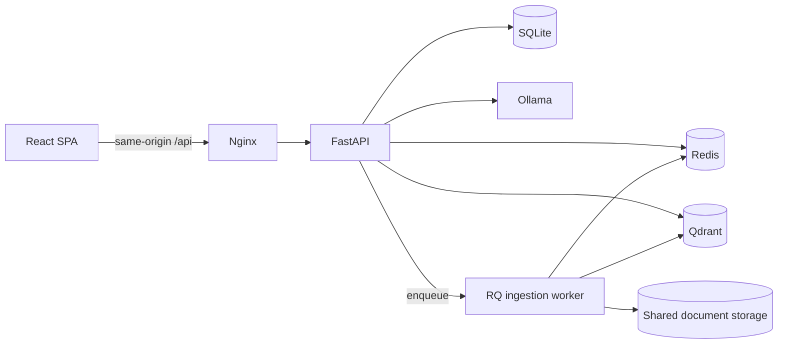

# Vietnamese Legal Assistant

An end-to-end RAG application for Vietnamese legal document search and
conversation. The project emphasizes secure authentication, durable document
ingestion, source citations, and a reproducible Docker setup.

## Architecture



## Engineering Highlights

- Vietnamese RAG pipeline using LlamaIndex, Hugging Face embeddings, Qdrant,
  and Ollama.
- Streaming chat responses with persisted sessions and document citations.
- Short-lived JWT access tokens in HttpOnly cookies with rotating,
  Redis-backed refresh sessions, CSRF protection, and session revocation.
- Durable RQ ingestion queue with retries, timeouts, failed-job retention,
  Redis AOF persistence, and a single GPU worker.
- Cross-process RAG cache invalidation through a Redis index version.
- Streaming upload validation with file count, size, MIME, signature, and
  UTF-8 checks.
- Redis-backed rate limits for authentication, chat, and administration.
- Same-origin Nginx deployment with CSP and security headers.
- Runtime response validation, request cancellation/timeouts, React error
  recovery, and tested authentication retry behavior.

## Run

1. Copy `.env.example` to `.env` and replace the required secrets.
2. Start the stack:

```bash
docker compose up --build
```

3. Open `http://localhost:3000`.

The RQ worker listens on the `document-ingestion` queue. Uploaded documents
remain queued across Redis restarts because AOF persistence is enabled.

## Verification

```bash
pytest -q
cd frontend
npm install
npm run lint
npm test
npm run build
```
