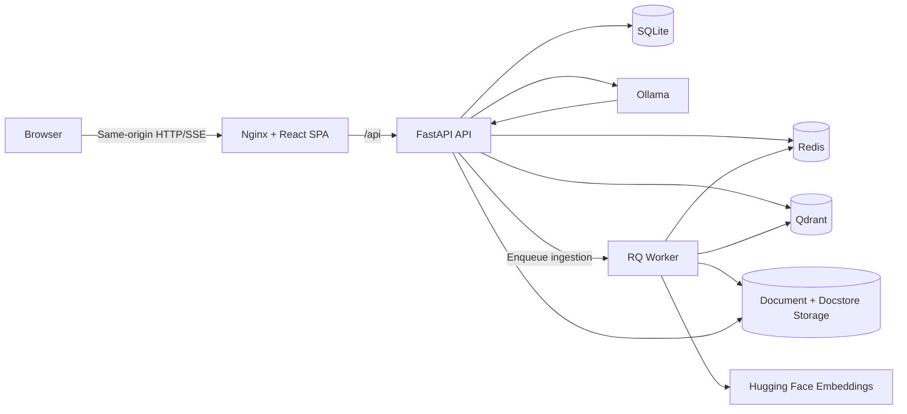
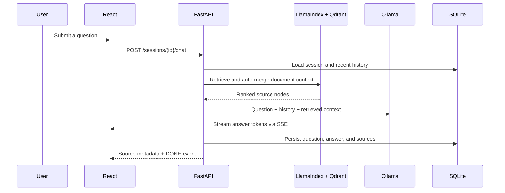
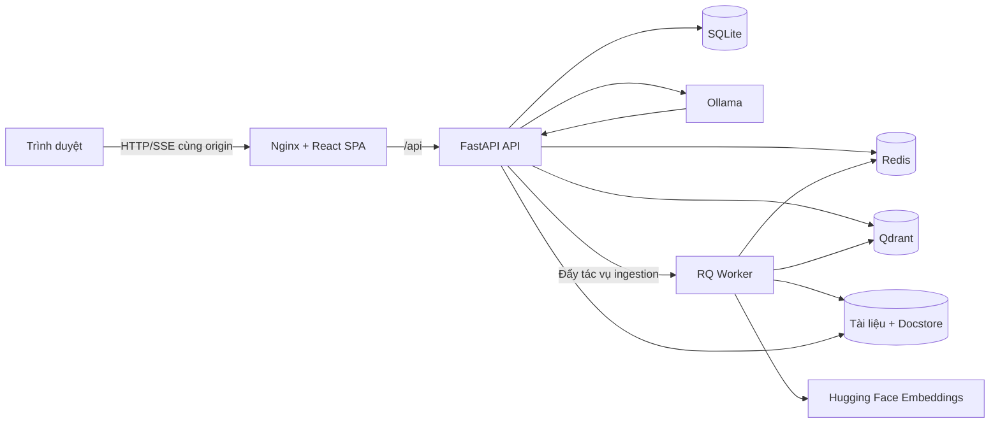

<div align="center">

# Local RAG Assistant

### A private, source-grounded, and customizable RAG platform

[](https://react.dev/)
[](https://fastapi.tiangolo.com/)
[](https://www.llamaindex.ai/)
[](https://ollama.com/)
[](https://qdrant.tech/)
[](https://www.docker.com/)

Build a domain-specific AI assistant that streams grounded answers from an
administrator-managed document collection and exposes the cited source files.

[English](#english) | [Tiếng Việt](#tiếng-việt)

</div>

---

# English

## Overview

Local RAG Assistant is a full-stack Retrieval-Augmented Generation (RAG)
platform for private, source-grounded document search and conversation. It
combines a locally hosted language model with hierarchical document retrieval,
persistent chat sessions, source citations, secure cookie-based authentication,
and an administration workspace for managing the knowledge base.

The architecture is domain- and language-agnostic. Replace the LLM, embedding
model, system prompt, and interface text to adapt it to another language or use
case such as internal knowledge management, technical support, education,
finance, healthcare, or legal research.

The repository currently ships with a Vietnamese legal-assistant preset:
`qwen2.5:7b`, a Vietnamese document embedding model, and Vietnamese prompts/UI
text. These are defaults, not architectural restrictions.

The stack runs locally with Docker Compose. Documents, account data, vector
embeddings, queues, and model caches remain under your infrastructure.

> [!IMPORTANT]
> AI-generated answers can be incomplete or incorrect. Validate important
> conclusions against authoritative sources and add domain-specific safeguards
> before using the system in high-stakes environments.

## Why This Project

- **Grounded answers:** the assistant is instructed to answer from retrieved
  documents instead of relying only on model memory.
- **Language and domain flexibility:** choose an LLM, embedding model, prompt,
  and document collection that fit the target language and subject.
- **Traceable research:** answers include source filename, page information,
  relevance score, and authenticated access to the original file.
- **Local AI:** Ollama provides model inference without requiring a hosted LLM
  API.
- **Operationally durable:** Redis Queue, retries, persistent Redis storage,
  staged uploads, and versioned retriever invalidation protect ingestion work.
- **Security-aware design:** rotating refresh sessions, HttpOnly cookies, CSRF
  validation, role checks, rate limits, upload inspection, and restrictive
  Nginx headers are built in.

## Features

### User Experience

- Account registration, login, logout, and logout from all devices.
- Multi-session chat with persistent conversation history.
- Real-time answers over Server-Sent Events (SSE).
- Cancelable response generation.
- Markdown and GitHub-Flavored Markdown rendering.
- Automatically generated conversation titles.
- Source cards that open the authenticated original document.
- Responsive desktop and mobile interface.
- Runtime validation of API responses and graceful error recovery.

### RAG and Document Processing

- PDF, DOCX, and UTF-8 TXT uploads.
- PyMuPDF-based PDF extraction.
- Hierarchical chunks of `1024`, `512`, and `256` tokens with overlap.
- Hugging Face embeddings with GPU/CPU device detection.
- Qdrant-backed vector retrieval.
- LlamaIndex `AutoMergingRetriever` for parent-context reconstruction.
- Top-12 initial similarity retrieval.
- Conversation context from the latest 20 messages.
- Source metadata persisted with every assistant response.
- Replacement-first re-ingestion so an existing index remains available if a
  new indexing attempt fails.
- Cross-process retriever cache invalidation through a Redis index version.

### Administration

- Role-protected document management page.
- Drag-and-drop multi-file upload.
- Background ingestion status tracking.
- Document listing, deletion, and source file access.
- Destructive bulk operations protected by admin password re-verification.
- Automatic super-admin creation and credential synchronization from
  environment variables.

### Security and Reliability

- Bcrypt password hashing.
- Short-lived JWT access tokens stored in HttpOnly cookies.
- Opaque refresh tokens stored as SHA-256 hashes in Redis.
- Atomic refresh-token rotation and server-side session revocation.
- Double-submit CSRF protection with constant-time token comparison.
- Origin validation for state-changing browser requests.
- Redis-backed rate limits for authentication, chat, and administration.
- Per-user ownership checks for sessions and message history.
- Path traversal protection for document access and deletion.
- Streaming upload size enforcement before files reach memory.
- MIME type, file signature, DOCX structure, and UTF-8 validation.
- RQ retries, job timeouts, result retention, and failed-job retention.
- Nginx CSP, frame, content-type, referrer, and permissions headers.

## Architecture



### Main Chat Flow



## Technology Stack

| Layer | Technologies |
|---|---|
| Frontend | React 19, TypeScript, Vite 8, React Router, React Markdown, Lucide |
| API | FastAPI, Pydantic, SQLAlchemy |
| RAG | LlamaIndex, hierarchical parsing, Auto-Merging Retrieval |
| LLM | Ollama, default `qwen2.5:7b` |
| Embeddings | Sentence Transformers; current preset: `dangvantuan/vietnamese-document-embedding` |
| Vector database | Qdrant |
| Application database | SQLite by default; SQLAlchemy configuration supports another database URL |
| Queue and cache | Redis 7, RQ |
| Document extraction | PyMuPDF, PyPDF, LlamaIndex file readers |
| Delivery | Docker Compose, Nginx |
| Testing | Pytest, Vitest, Testing Library |

## Quick Start

### Prerequisites

- Docker Desktop or Docker Engine with Docker Compose.
- An NVIDIA GPU and a working NVIDIA Container Toolkit are recommended and
  expected by the provided Compose GPU reservations.
- Sufficient disk space for the Ollama model, embedding model, and document
  index.

### 1. Configure the Environment

```powershell
Copy-Item .env.example .env
```

At minimum, replace these values in `.env`:

```dotenv
JWT_SECRET_KEY=replace_with_a_long_random_secret
SUPER_ADMIN_USERNAME=admin
SUPER_ADMIN_PASSWORD=replace_with_a_strong_admin_password

# Use Qdrant's internal HTTP port with the current client configuration.
QDRANT_URL=http://qdrant:6333

# Allow the embedding model to download on the first run.
HF_HUB_OFFLINE=0
TRANSFORMERS_OFFLINE=0
```

Generate a strong JWT secret with:

```powershell
python -c "import secrets; print(secrets.token_urlsafe(48))"
```

### 2. Start Infrastructure and Pull the LLM

```powershell
docker compose up -d ollama qdrant redis
docker compose exec ollama ollama pull qwen2.5:7b
```

### 3. Build and Start the Application

```powershell
docker compose up --build
```

The first backend/worker startup downloads the Hugging Face embedding model and
can take several minutes. After the model is cached in the `hf_cache` volume,
you may set `HF_HUB_OFFLINE=1` and `TRANSFORMERS_OFFLINE=1`.

Open:

- Application: [http://localhost:3000](http://localhost:3000)
- Backend health check: [http://localhost:8000](http://localhost:8000)
- Qdrant dashboard: [http://localhost:6333/dashboard](http://localhost:6333/dashboard)

Sign in with `SUPER_ADMIN_USERNAME` and `SUPER_ADMIN_PASSWORD`, open
**Document Management**, upload source documents, wait for ingestion to finish,
and start a new conversation.

## Configuration

| Variable | Default | Purpose |
|---|---:|---|
| `OLLAMA_MODEL` | `qwen2.5:7b` | Local chat model |
| `EMBEDDING_MODEL` | `dangvantuan/vietnamese-document-embedding` | Document/query embedding model; replace it for another language/domain |
| `EMBEDDING_DIMENSION` | `768` | Qdrant vector dimension |
| `QDRANT_COLLECTION_NAME` | `legal_documents` | Vector collection |
| `DATABASE_URL` | `sqlite:////app/data/db.sqlite3` | Application database |
| `ACCESS_TOKEN_EXPIRE_MINUTES` | `15` | Access-token lifetime |
| `REFRESH_TOKEN_EXPIRE_DAYS` | `30` | Login session lifetime |
| `UPLOAD_MAX_FILES` | `10` | Files per upload |
| `UPLOAD_MAX_FILE_MB` | `10` | Maximum individual file size |
| `UPLOAD_MAX_TOTAL_MB` | `50` | Maximum upload batch size |
| `RATE_LIMIT_CHAT_USER_PER_MINUTE` | `20` | Per-user chat limit |
| `RQ_QUEUE_NAME` | `document-ingestion` | Background ingestion queue |
| `RQ_JOB_TIMEOUT_SECONDS` | `3600` | Ingestion job timeout |

See [`.env.example`](.env.example) for the complete configuration reference.
For production, use HTTPS, set `APP_ENV=production`, enable
`AUTH_COOKIE_SECURE=true`, and configure explicit HTTPS origins.

## API Overview

All application endpoints are mounted under `/api`.

| Area | Endpoints |
|---|---|
| Authentication | `POST /auth/register`, `POST /auth/login`, `POST /auth/refresh`, `POST /auth/logout`, `POST /auth/logout-all`, `GET /auth/me` |
| Sessions | `POST /sessions/`, `GET /sessions/`, `GET /sessions/{id}/messages`, `PATCH /sessions/{id}/title`, `DELETE /sessions/{id}` |
| Chat | `POST /sessions/{id}/chat` |
| Documents | `GET /documents/`, `POST /documents/ingest`, `GET /documents/tasks/{id}`, `DELETE /documents/{filename}`, `GET /documents/file/{filename}` |
| Admin bulk actions | `DELETE /documents/all`, `DELETE /sessions/all` |

The chat endpoint returns `text/event-stream` events containing `chunk`,
`sources`, `error`, and a final `[DONE]` marker.

## Project Structure

```text
.
├── backend/
│   ├── app/
│   │   ├── api/            # Auth, chat session, and document routes
│   │   ├── db/             # SQLAlchemy, Redis, and Qdrant connections
│   │   ├── models/         # User, session, and message models
│   │   ├── repositories/   # Database access layer
│   │   ├── schemas/        # Pydantic request/response schemas
│   │   ├── services/       # Auth, RAG, ingestion, security, and chat logic
│   │   ├── main.py         # FastAPI app and browser security middleware
│   │   └── rq_worker.py    # Document-ingestion worker
│   ├── Dockerfile
│   └── requirements.txt
├── frontend/
│   ├── src/
│   │   ├── components/     # Sidebar, dialogs, and error boundary
│   │   ├── context/        # Authentication state and API client
│   │   ├── hooks/          # SSE chat streaming
│   │   ├── pages/          # Login, chat, and administration pages
│   │   └── utils/          # API, SSE, and runtime validation helpers
│   ├── Dockerfile
│   └── nginx.conf
├── tests/                  # Backend, security, queue, and deployment tests
├── .env.example
└── docker-compose.yml
```

## Development and Verification

Backend tests:

```powershell
pytest -q
```

Frontend checks:

```powershell
Set-Location frontend
npm install
npm run lint
npm test
npm run build
```

The test suite covers authentication cookies and refresh rotation, CSRF and
origin checks, rate limits, upload limits and signatures, secure file serving,
admin bootstrap, worker startup, RQ behavior, deployment configuration, API
response validation, SSE parsing, and authentication retry policy.

## Data and Persistence

| Data | Storage |
|---|---|
| Users, chat sessions, messages | SQLite |
| Embeddings and vector metadata | Qdrant volume |
| Refresh sessions, rate limits, queue jobs, RAG version | Redis AOF volume |
| Ollama models | Ollama volume |
| Hugging Face models | Hugging Face cache volume |
| Uploaded documents and LlamaIndex docstore | Backend-mounted storage |

To stop the application without deleting data:

```powershell
docker compose down
```

Deleting Docker volumes permanently removes persisted models, vectors, queues,
and caches. Back up important documents and databases before destructive
maintenance.

## Roadmap Ideas

- PostgreSQL support as the default production database.
- Automated document metadata extraction and version tracking.
- Hybrid dense/sparse retrieval and reranking.
- Per-document access controls and multi-tenant workspaces.
- Observability dashboards for retrieval quality, latency, and queue health.
- Continuous integration and end-to-end browser tests.

## Contributing

1. Create a focused branch from the active development branch.
2. Keep backend and frontend changes covered by relevant tests.
3. Run the verification commands above.
4. Open a pull request describing behavior changes, security impact, and
   deployment considerations.

---

# Tiếng Việt

## Tổng quan

Local RAG Assistant là nền tảng Retrieval-Augmented Generation (RAG) full-stack
dành cho việc tra cứu và hội thoại riêng tư, có căn cứ trên kho tài liệu. Hệ
thống kết hợp mô hình ngôn ngữ chạy cục bộ, truy xuất tài liệu phân cấp, lịch sử
hội thoại bền vững, trích dẫn nguồn, xác thực bằng cookie an toàn và khu vực
quản trị kho tri thức.

Kiến trúc không bị giới hạn theo ngôn ngữ hay lĩnh vực. Người triển khai có thể
thay LLM, embedding model, system prompt và nội dung giao diện để sử dụng cho
ngôn ngữ hoặc bài toán khác như kho tri thức nội bộ, hỗ trợ kỹ thuật, giáo dục,
tài chính, y tế hay tra cứu pháp luật.

Repository hiện đi kèm một preset trợ lý pháp luật tiếng Việt, gồm
`qwen2.5:7b`, embedding model cho tài liệu tiếng Việt và prompt/UI tiếng Việt.
Đây chỉ là cấu hình mặc định, không phải giới hạn của kiến trúc.

Toàn bộ stack chạy bằng Docker Compose. Tài liệu, tài khoản, vector embedding,
hàng đợi và model cache đều nằm trong hạ tầng do bạn kiểm soát.

> [!IMPORTANT]
> Câu trả lời do AI tạo ra có thể thiếu hoặc sai. Hãy đối chiếu các kết luận
> quan trọng với nguồn có thẩm quyền và bổ sung cơ chế kiểm soát phù hợp trước
> khi dùng hệ thống trong các lĩnh vực có mức độ rủi ro cao.

## Điểm nổi bật

- **Câu trả lời có căn cứ:** trợ lý được yêu cầu chỉ sử dụng nội dung truy xuất
  từ kho tài liệu thay vì chỉ dựa vào kiến thức có sẵn của model.
- **Linh hoạt ngôn ngữ và lĩnh vực:** có thể chọn LLM, embedding model, prompt
  và kho tài liệu phù hợp với bài toán cần triển khai.
- **Có thể kiểm chứng:** mỗi câu trả lời lưu nguồn, trang, điểm liên quan và cho
  phép người dùng đã đăng nhập mở tài liệu gốc.
- **AI chạy cục bộ:** Ollama xử lý suy luận mà không bắt buộc dùng API LLM bên
  thứ ba.
- **Ingestion bền vững:** Redis Queue, retry, lưu hàng đợi, upload staging và
  cơ chế làm mới retriever giúp giảm rủi ro mất tác vụ.
- **Bảo mật nhiều lớp:** refresh token xoay vòng, HttpOnly cookie, CSRF, phân
  quyền, rate limit, kiểm tra tệp và security headers.

## Tính năng

### Dành cho người dùng

- Đăng ký, đăng nhập, đăng xuất và thu hồi phiên trên mọi thiết bị.
- Tạo nhiều cuộc hội thoại và lưu lịch sử lâu dài.
- Nhận câu trả lời theo thời gian thực qua SSE.
- Dừng quá trình sinh câu trả lời.
- Hiển thị Markdown và GitHub-Flavored Markdown.
- Tự động tạo tiêu đề hội thoại.
- Mở tài liệu nguồn trực tiếp từ thẻ trích dẫn.
- Giao diện responsive cho desktop và mobile.
- Kiểm tra cấu trúc phản hồi API ở runtime và phục hồi lỗi giao diện.

### RAG và xử lý tài liệu

- Upload PDF, DOCX và TXT mã hóa UTF-8.
- Đọc PDF bằng PyMuPDF.
- Chia tài liệu phân cấp theo kích thước `1024`, `512`, `256`, có overlap.
- Tạo embedding bằng Hugging Face trên GPU hoặc CPU.
- Lưu và truy xuất vector bằng Qdrant.
- Dùng `AutoMergingRetriever` để ghép lại ngữ cảnh cha phù hợp.
- Truy xuất ban đầu top 12 kết quả tương đồng.
- Đưa tối đa 20 tin nhắn gần nhất vào ngữ cảnh hội thoại.
- Lưu metadata nguồn cùng câu trả lời.
- Ghi phiên bản index mới trước khi xóa phiên bản cũ.
- Đồng bộ cache retriever giữa các process qua Redis index version.

### Dành cho quản trị viên

- Trang quản lý tài liệu được bảo vệ theo role.
- Kéo thả và upload nhiều tệp.
- Theo dõi trạng thái xử lý nền.
- Xem danh sách, xóa và truy cập tài liệu.
- Yêu cầu nhập lại mật khẩu admin trước thao tác xóa hàng loạt.
- Tự động tạo và đồng bộ tài khoản super admin từ biến môi trường.

### Bảo mật và độ tin cậy

- Băm mật khẩu bằng bcrypt.
- JWT access token thời hạn ngắn trong HttpOnly cookie.
- Refresh token ngẫu nhiên, chỉ lưu hash SHA-256 trong Redis.
- Xoay refresh token nguyên tử và thu hồi phiên phía server.
- Double-submit CSRF và so sánh token constant-time.
- Kiểm tra Origin cho request thay đổi dữ liệu.
- Rate limit bằng Redis cho đăng nhập, đăng ký, chat và upload.
- Kiểm tra quyền sở hữu session và lịch sử tin nhắn.
- Chống path traversal khi đọc hoặc xóa tài liệu.
- Giới hạn dung lượng ngay trong quá trình stream upload.
- Kiểm tra MIME, chữ ký tệp, cấu trúc DOCX và UTF-8.
- RQ retry, timeout và lưu trạng thái tác vụ lỗi.
- CSP cùng các security headers trên Nginx.

## Kiến trúc



## Khởi chạy nhanh

### Yêu cầu

- Docker Desktop hoặc Docker Engine có Docker Compose.
- GPU NVIDIA và NVIDIA Container Toolkit được khuyến nghị; Compose hiện tại
  đã khai báo GPU reservation.
- Đủ dung lượng cho model Ollama, model embedding và dữ liệu vector.

### 1. Tạo cấu hình

```powershell
Copy-Item .env.example .env
```

Thay tối thiểu các giá trị sau trong `.env`:

```dotenv
JWT_SECRET_KEY=thay_bang_chuoi_bi_mat_dai_va_ngau_nhien
SUPER_ADMIN_USERNAME=admin
SUPER_ADMIN_PASSWORD=thay_bang_mat_khau_admin_manh

# Dùng cổng HTTP nội bộ của Qdrant với cấu hình client hiện tại.
QDRANT_URL=http://qdrant:6333

# Cho phép tải model embedding ở lần chạy đầu.
HF_HUB_OFFLINE=0
TRANSFORMERS_OFFLINE=0
```

Tạo JWT secret mạnh:

```powershell
python -c "import secrets; print(secrets.token_urlsafe(48))"
```

### 2. Khởi động hạ tầng và tải LLM

```powershell
docker compose up -d ollama qdrant redis
docker compose exec ollama ollama pull qwen2.5:7b
```

### 3. Build và chạy toàn bộ hệ thống

```powershell
docker compose up --build
```

Lần khởi động backend/worker đầu tiên sẽ tải model embedding Hugging Face và có
thể mất vài phút. Sau khi model đã nằm trong volume `hf_cache`, có thể chuyển
`HF_HUB_OFFLINE=1` và `TRANSFORMERS_OFFLINE=1`.

Truy cập:

- Ứng dụng: [http://localhost:3000](http://localhost:3000)
- Health check backend: [http://localhost:8000](http://localhost:8000)
- Qdrant dashboard: [http://localhost:6333/dashboard](http://localhost:6333/dashboard)

Đăng nhập bằng `SUPER_ADMIN_USERNAME` và `SUPER_ADMIN_PASSWORD`, mở trang
**Quản lý Tài liệu**, upload tài liệu nguồn, chờ ingestion hoàn tất rồi bắt
đầu hội thoại.

## Biến cấu hình chính

| Biến | Mặc định | Mục đích |
|---|---:|---|
| `OLLAMA_MODEL` | `qwen2.5:7b` | Model hội thoại cục bộ |
| `EMBEDDING_MODEL` | `dangvantuan/vietnamese-document-embedding` | Model embedding của preset hiện tại; thay thế theo ngôn ngữ/lĩnh vực |
| `EMBEDDING_DIMENSION` | `768` | Số chiều vector |
| `QDRANT_COLLECTION_NAME` | `legal_documents` | Tên collection |
| `DATABASE_URL` | `sqlite:////app/data/db.sqlite3` | Cơ sở dữ liệu ứng dụng |
| `ACCESS_TOKEN_EXPIRE_MINUTES` | `15` | Thời hạn access token |
| `REFRESH_TOKEN_EXPIRE_DAYS` | `30` | Thời hạn phiên đăng nhập |
| `UPLOAD_MAX_FILES` | `10` | Số tệp mỗi lần upload |
| `UPLOAD_MAX_FILE_MB` | `10` | Dung lượng tối đa mỗi tệp |
| `UPLOAD_MAX_TOTAL_MB` | `50` | Tổng dung lượng mỗi lần upload |
| `RATE_LIMIT_CHAT_USER_PER_MINUTE` | `20` | Giới hạn chat mỗi người dùng |
| `RQ_QUEUE_NAME` | `document-ingestion` | Hàng đợi ingestion |
| `RQ_JOB_TIMEOUT_SECONDS` | `3600` | Timeout tác vụ ingestion |

Xem [`.env.example`](.env.example) để biết toàn bộ cấu hình. Khi triển khai
production, hãy dùng HTTPS, đặt `APP_ENV=production`,
`AUTH_COOKIE_SECURE=true` và khai báo cụ thể các HTTPS origin được phép.

## Tổng quan API

Tất cả endpoint nằm dưới prefix `/api`.

| Nhóm | Endpoint |
|---|---|
| Xác thực | `POST /auth/register`, `POST /auth/login`, `POST /auth/refresh`, `POST /auth/logout`, `POST /auth/logout-all`, `GET /auth/me` |
| Hội thoại | `POST /sessions/`, `GET /sessions/`, `GET /sessions/{id}/messages`, `PATCH /sessions/{id}/title`, `DELETE /sessions/{id}` |
| Chat AI | `POST /sessions/{id}/chat` |
| Tài liệu | `GET /documents/`, `POST /documents/ingest`, `GET /documents/tasks/{id}`, `DELETE /documents/{filename}`, `GET /documents/file/{filename}` |
| Xóa hàng loạt | `DELETE /documents/all`, `DELETE /sessions/all` |

Endpoint chat trả về `text/event-stream` với các event `chunk`, `sources`,
`error` và marker kết thúc `[DONE]`.

## Kiểm thử

Backend:

```powershell
pytest -q
```

Frontend:

```powershell
Set-Location frontend
npm install
npm run lint
npm test
npm run build
```

Bộ test bao phủ cookie xác thực và refresh rotation, CSRF, Origin, rate limit,
giới hạn và chữ ký upload, phục vụ file an toàn, bootstrap admin, worker, RQ,
cấu hình deployment, validation phản hồi API, parser SSE và chính sách retry
xác thực.

## Dữ liệu lưu trữ

| Dữ liệu | Nơi lưu |
|---|---|
| Người dùng, session chat, tin nhắn | SQLite |
| Embedding và metadata vector | Qdrant volume |
| Phiên refresh, rate limit, queue, RAG version | Redis AOF volume |
| Model Ollama | Ollama volume |
| Model Hugging Face | Hugging Face cache volume |
| Tài liệu upload và LlamaIndex docstore | Storage được mount vào backend |

Dừng hệ thống nhưng giữ dữ liệu:

```powershell
docker compose down
```

Xóa Docker volume sẽ xóa vĩnh viễn model, vector, queue và cache tương ứng. Hãy
sao lưu tài liệu và database quan trọng trước các thao tác bảo trì có
tính phá hủy.

## Định hướng phát triển

- Dùng PostgreSQL làm database production mặc định.
- Tự động trích xuất metadata và theo dõi phiên bản tài liệu.
- Hybrid search dense/sparse và reranking.
- Phân quyền theo tài liệu và workspace đa tenant.
- Dashboard quan sát chất lượng retrieval, latency và queue.
- CI cùng kiểm thử end-to-end trên trình duyệt.

## Đóng góp

1. Tạo branch riêng cho thay đổi.
2. Bổ sung test phù hợp cho backend hoặc frontend.
3. Chạy toàn bộ lệnh kiểm tra ở trên.
4. Mở pull request và mô tả thay đổi hành vi, ảnh hưởng bảo mật cùng lưu ý
   triển khai.

---

<div align="center">

Built for transparent, private, and verifiable retrieval-augmented generation.

Được xây dựng hướng tới các hệ thống RAG minh bạch, riêng tư và có thể kiểm
chứng.

</div>
