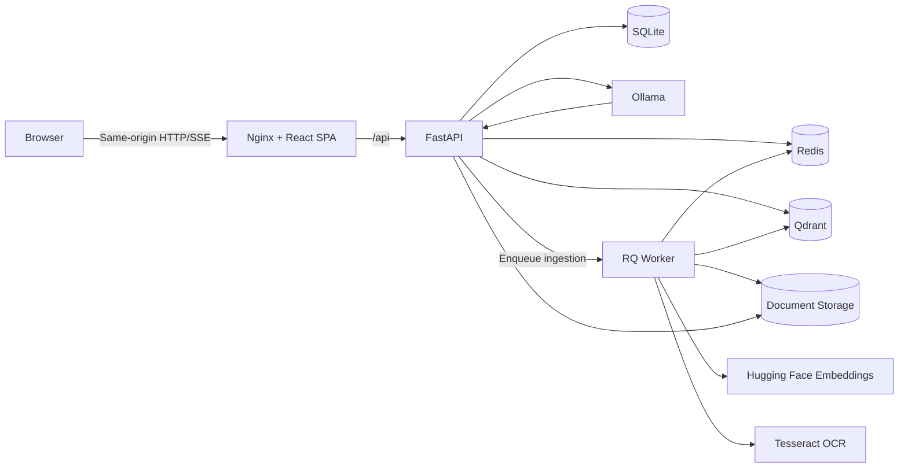

<div align="center">

# Local RAG Assistant

### A private, source-grounded, and highly customizable AI platform

[](https://react.dev/)
[](https://fastapi.tiangolo.com/)
[](https://www.llamaindex.ai/)
[](https://ollama.com/)
[](https://qdrant.tech/)
[](https://www.docker.com/)
[](https://opensource.org/licenses/MIT)

*Your personal, offline-capable AI brain. Feed it documents, ask questions, and get precise, cited answers.*


[English](#english) | [Tiếng Việt](#tiếng-việt)

</div>

---

# English

## 🌟 Overview

**Local RAG Assistant** is a full-stack Retrieval-Augmented Generation (RAG) platform designed for **100% privacy**. It allows you to chat with your documents using local AI models, meaning your sensitive data never leaves your machine. 

Currently pre-configured as a **Legal Assistant** (with Vietnamese document embedding and OCR optimization), the architecture is entirely domain-agnostic. You can effortlessly customize it for medical, financial, IT, or personal knowledge bases.

## ✨ Key Features

- 🧠 **100% Local & Private**: Powered by Ollama and Qdrant. No OpenAI keys, no data leaks. Your files and chats remain strictly on your infrastructure.
- 📄 **Smart Document OCR (Tesseract)**: Automatically detects scanned PDFs and falls back to Tesseract OCR for text extraction. Specifically optimized for accurate Vietnamese diacritics.
- ⚡ **Advanced RAG Architecture**: Utilizes LlamaIndex's `AutoMergingRetriever` for hierarchical context reconstruction, ensuring the AI understands the broader context, not just fragmented sentences.
- 💬 **Premium Streaming UX**: Real-time Server-Sent Events (SSE) streaming with a robust parser that gracefully handles AI conversational preambles without breaking UI rendering.
- 🔍 **Interactive Citations**: Answers are backed by clickable source cards. Clicking a source instantly opens the integrated PDF viewer, automatically scrolling to the exact cited page.
- 🌐 **Multilingual Interface (i18n)**: Instantly toggle between English and Vietnamese UI.
- 🛡️ **Enterprise-grade Security**: HttpOnly JWT cookies, rotating refresh tokens, CSRF protection, and role-based access control (Admin vs. User).

## 🏗️ Architecture



## 🚀 Quick Start & Deployment

### Prerequisites
- Docker Desktop or Docker Engine + Docker Compose.
- NVIDIA GPU (Recommended) + NVIDIA Container Toolkit for fast inference.

### 1. Configure the Environment
Clone the repository and set up your environment variables:
```bash
git clone https://github.com/yourusername/local-rag-assistant.git
cd local-rag-assistant
cp .env.example .env
```
Open `.env` and configure your secure credentials:
- `JWT_SECRET_KEY`: Generate a secure random string.
- `SUPER_ADMIN_USERNAME` & `SUPER_ADMIN_PASSWORD`: Your credentials for the admin dashboard.

### 2. Launch the Stack
```bash
docker compose up --build -d
```
Once the containers are healthy, open `http://localhost:3000` in your browser.


## 🛠️ Customization Notes (For Developers)

This project is built to be yours. Here is how you can tweak it after pulling:

1. **Change the LLM**: Open `.env` and change `OLLAMA_MODEL=qwen2.5:7b` to your preferred model (e.g., `llama3`, `mistral`). Make sure you have pulled it in Ollama.
2. **Change the Embedding Model**: Update `EMBEDDING_MODEL` in `.env`. The default (`dangvantuan/vietnamese-document-embedding`) is optimized for Vietnamese. For English, consider `BAAI/bge-small-en-v1.5`.
3. **Change the AI Persona**: Head over to `backend/app/services/session_service.py` and modify `CUSTOM_SYSTEM_PROMPT`. You can easily turn the "Legal Assistant" into a "Medical Assistant" or "Code Reviewer".
4. **Change OCR Language**: The `Dockerfile` in the `backend/` directory installs `tesseract-ocr-vie`. You can change this to `tesseract-ocr-eng` or other languages depending on your documents.

---

# Tiếng Việt

## 🌟 Tổng quan

**Local RAG Assistant** là một nền tảng Hỏi-Đáp tài liệu thông minh (RAG) được thiết kế với tiêu chí **bảo mật 100%**. Hệ thống cho phép bạn trò chuyện với kho tài liệu của mình thông qua các mô hình AI chạy cục bộ, đảm bảo dữ liệu nhạy cảm không bao giờ bị tải lên Internet.

Mặc dù được thiết lập sẵn như một **Trợ lý Pháp lý** (tối ưu hóa nhúng văn bản và OCR tiếng Việt), kiến trúc dự án hoàn toàn độc lập với lĩnh vực. Bạn có thể dễ dàng tùy biến nó thành trợ lý y tế, tài chính, IT, hoặc quản lý tri thức cá nhân.

## ✨ Tính năng Nổi bật

- 🧠 **Chạy Local & Riêng tư 100%**: Sức mạnh từ Ollama và Qdrant. Không cần API key của OpenAI, không lo rò rỉ dữ liệu.
- 📄 **Smart OCR (Tesseract)**: Tự động phát hiện các file PDF dạng ảnh (scanned) và kích hoạt Tesseract OCR để trích xuất văn bản. Tối ưu hóa đặc biệt để nhận diện chính xác tuyệt đối dấu tiếng Việt.
- ⚡ **Kiến trúc RAG Tiên tiến**: Sử dụng `AutoMergingRetriever` của LlamaIndex giúp AI tự động kết hợp các đoạn văn bản nhỏ thành ngữ cảnh lớn, giúp câu trả lời sâu sắc và bao quát hơn.
- 💬 **Trải nghiệm UX Cao cấp**: Phản hồi theo thời gian thực (Streaming SSE) với bộ xử lý thông minh, tự động loại bỏ các lỗi rác JSON từ AI mà không làm vỡ giao diện.
- 🔍 **Trích dẫn Tương tác**: Câu trả lời đi kèm thẻ Nguồn minh bạch. Khi click vào nguồn, trình xem PDF tích hợp sẽ lập tức cuộn đến đúng số trang được trích dẫn một cách mượt mà.
- 🌐 **Giao diện Đa ngôn ngữ (i18n)**: Chuyển đổi tức thì giữa Tiếng Anh và Tiếng Việt.
- 🛡️ **Bảo mật cấp Doanh nghiệp**: Xác thực qua HttpOnly JWT cookies, chống CSRF, và phân quyền chặt chẽ giữa Admin và User.

## 🚀 Hướng dẫn Triển khai

### Yêu cầu hệ thống
- Docker Desktop hoặc Docker Engine + Docker Compose.
- Card đồ họa NVIDIA (Khuyên dùng) + NVIDIA Container Toolkit để AI phản hồi nhanh.

### 1. Cấu hình Môi trường
Clone dự án và thiết lập file môi trường:
```bash
git clone https://github.com/yourusername/local-rag-assistant.git
cd local-rag-assistant
cp .env.example .env
```
Mở file `.env` và thay đổi các cấu hình bảo mật:
- `JWT_SECRET_KEY`: Thay bằng một chuỗi ngẫu nhiên, độ dài cao.
- `SUPER_ADMIN_USERNAME` & `SUPER_ADMIN_PASSWORD`: Tài khoản quản trị để upload tài liệu.

### 2. Khởi động Hệ thống
```bash
docker compose up --build -d
```
Sau khi các container báo trạng thái `healthy`, truy cập `http://localhost:3000` trên trình duyệt.

## 🛠️ Tùy biến Cá nhân (Dành cho Lập trình viên)

Dự án này là của bạn. Dưới đây là cách tinh chỉnh sau khi pull code về:

1. **Đổi LLM (Mô hình AI)**: Mở `.env` và sửa `OLLAMA_MODEL=qwen2.5:7b` thành mô hình bạn thích (VD: `llama3`, `mistral`).
2. **Đổi Mô hình Embedding**: Mặc định là `dangvantuan/vietnamese-document-embedding` dành riêng cho tiếng Việt. Nếu kho tài liệu của bạn toàn tiếng Anh, hãy thử `BAAI/bge-small-en-v1.5` trong file `.env`.
3. **Đổi "Tính cách" AI**: Mở file `backend/app/services/session_service.py` và sửa biến `CUSTOM_SYSTEM_PROMPT`. Bạn có thể dễ dàng biến "Trợ lý Pháp lý" thành "Bác sĩ tư vấn" hoặc "Chuyên gia Tài chính".
4. **Thay đổi ngôn ngữ OCR**: File `Dockerfile` trong thư mục `backend/` đang cài đặt `tesseract-ocr-vie`. Bạn có thể thay thành ngôn ngữ tương ứng với tài liệu của mình.

---

> **Lưu ý**: Đây là một dự án cá nhân (Personal Project). Hệ thống sử dụng giấy phép MIT, bạn hoàn toàn có thể tự do sao chép (Fork) và chỉnh sửa mã nguồn phục vụ cho mục đích riêng của mình.
