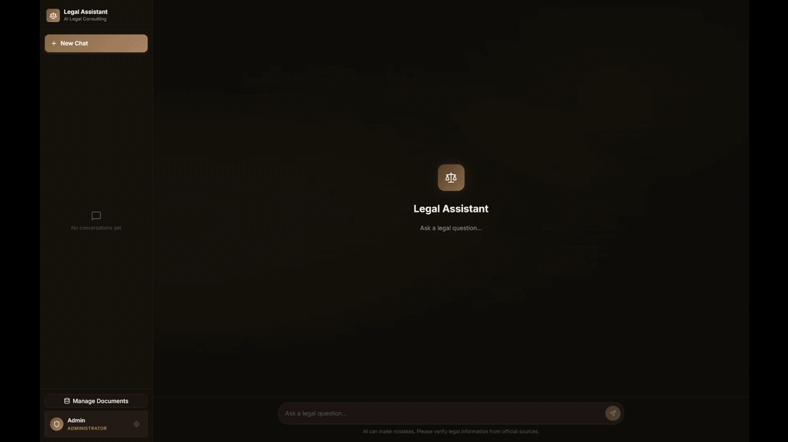
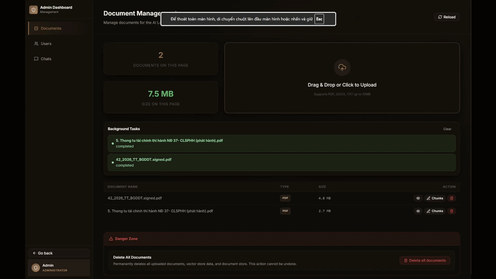
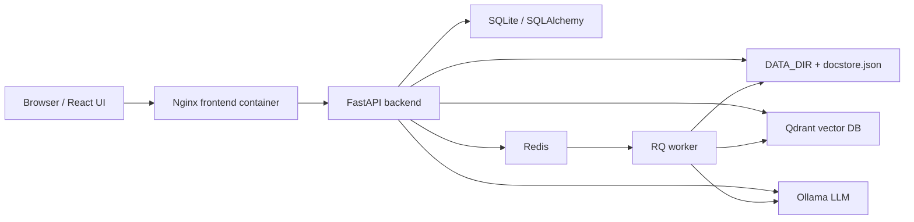

<div align="center">

# Legal Assistant - Local RAG Assistant

### A private, source-grounded RAG platform for legal document Q&A

[](https://react.dev/)
[](https://fastapi.tiangolo.com/)
[](https://www.llamaindex.ai/)
[](https://ollama.com/)
[](https://qdrant.tech/)
[](https://www.docker.com/)

Ask questions over your private legal documents with local LLMs, source-grounded retrieval, and a role-protected admin dashboard.



[English](#english) | [Tiếng Việt](#tiếng-việt)

</div>

---

# English

## Overview

Legal Assistant is a full-stack local Retrieval-Augmented Generation (RAG) application for asking questions over private legal documents. It combines a React frontend, FastAPI backend, Ollama local LLM, Qdrant vector database, Redis/RQ background jobs, and LlamaIndex document retrieval.

The project is designed for private knowledge bases where documents, chat history, vectors, and model execution remain under your control.

> AI-generated answers may be incomplete or incorrect. Always verify important legal conclusions against authoritative sources and the original documents.

## Key Features

### End-User Experience

- Secure registration, login, logout, and logout from all devices.
- Cookie-based authentication with HttpOnly access tokens and refresh sessions.
- CSRF protection for state-changing browser requests.
- Multi-session chat with persistent history.
- Rename and delete chat sessions.
- Server-Sent Events (SSE) streaming for real-time responses.
- Markdown and GitHub-Flavored Markdown rendering.
- Source-aware answers with document references.
- Integrated PDF document viewer.
- English and Vietnamese interface.
- Responsive layout for desktop and mobile.

### RAG and Document Processing

- Upload and ingest PDF, DOC, DOCX, and TXT documents.
- Client-side and server-side upload limits.
- File metadata and signature validation.
- Smart PDF reading with OCR support through Tesseract.
- Hierarchical document chunking through LlamaIndex.
- Local Hugging Face embeddings.
- Default embedding model optimized for Vietnamese documents: `dangvantuan/vietnamese-document-embedding`.
- Qdrant vector storage.
- LlamaIndex `AutoMergingRetriever` for better context reconstruction.
- Retriever cache invalidation when documents change.
- Background ingestion through Redis Queue (RQ).
- Task polling for upload/ingestion status.

### Security and Access Control

- Role-based access control: `admin` and `user`.
- Super admin bootstrapped from environment variables.
- Admin self-protection in API for role/status/delete operations.
- Login, registration, chat, and upload rate limits.
- Origin validation and double-submit CSRF protection.
- Configurable cookie `Secure`, `SameSite`, and token expiration settings.
- Path traversal protection for document file serving.

## Admin Dashboard

The admin dashboard is available under `/admin` and requires an account with the `admin` role.



### Document Management

- View uploaded documents with pagination.
- Display filename, file type, and file size.
- Drag-and-drop multi-file upload.
- Validate file count, per-file size, and total upload size.
- Track background ingestion states: queued, processing, completed, failed.
- Reload the document list after ingestion.
- Preview documents:
  - PDFs open in an embedded viewer.
  - Text previews are available through the preview endpoint.
- Delete individual documents with confirmation.
- Delete all documents, vectors, and docstore after admin password verification.

### Chunk Management

- Open indexed chunks from a document row by clicking `Chunks`.
- Dedicated full-page route: `/admin/documents/:filename/chunks`.
- Review every indexed chunk for the selected document.
- See chunk order, chunk ID, and full chunk content.
- Edit chunk text in a wide full-page editor instead of a cramped modal.
- Save changes to persist the docstore and re-embed the chunk into Qdrant.
- Success and error feedback after saving.

### User Management

- View all users with pagination.
- See username, role, and active/banned status.
- Change role between `user` and `admin` with confirmation.
- Activate or ban users with confirmation.
- Reset user passwords.
- Delete users with confirmation.
- UI disables self-delete, self-ban, and self-role-change actions.

### Chat Management

- View all chat sessions across the system.
- Search chat sessions by username or title.
- See session creation date, username, and title.
- Open a conversation history viewer.
- Inspect message role, timestamp, content, and sources.
- Delete individual chat sessions.
- Delete all chat history after admin password verification.

## Architecture



### Main Modules

| Module | Purpose |
|---|---|
| `frontend/` | React 19 + TypeScript + Vite user and admin UI |
| `backend/app/main.py` | FastAPI app, CORS, CSRF middleware, startup lifecycle |
| `backend/app/api/auth.py` | Register, login, refresh, logout, `/me` |
| `backend/app/api/sessions.py` | Chat sessions and SSE chat endpoint |
| `backend/app/api/documents.py` | Upload, ingest, preview, chunks, document deletion |
| `backend/app/api/admin_users.py` | Admin user management |
| `backend/app/api/admin_chats.py` | Admin chat management |
| `backend/app/services/rag_pipeline.py` | Document ingestion, indexing, vector/docstore deletion |
| `backend/app/services/session_service.py` | Chat flow, message persistence, response streaming |
| `backend/app/services/task_service.py` | RQ task enqueueing and task status tracking |
| `backend/app/rq_worker.py` | Background ingestion worker |

## Technology Stack

| Layer | Technologies |
|---|---|
| Frontend | React 19, TypeScript, Vite, React Router, i18next, lucide-react, React Markdown |
| Backend | FastAPI, Pydantic, SQLAlchemy |
| Auth | JWT, HttpOnly cookies, refresh sessions, CSRF double-submit |
| AI/RAG | LlamaIndex, Ollama, Hugging Face embeddings |
| Vector DB | Qdrant |
| Queue/cache | Redis, RQ |
| Document parsing | PyMuPDF, pypdf, LlamaIndex readers, Tesseract OCR |
| Default DB | SQLite |
| Deployment | Docker, Docker Compose, Nginx |

## Requirements

Recommended:

- Docker Desktop or Docker Engine + Docker Compose.
- NVIDIA GPU and NVIDIA Container Toolkit for faster inference/embedding.
- Enough RAM for the LLM, embedding model, and Qdrant.
- Disk space for Ollama models, Hugging Face cache, uploaded documents, docstore, and Qdrant data.

For local development:

- Node.js compatible with Vite 8.
- Python 3.11+.
- Redis, Qdrant, and Ollama if not using Docker Compose.

## Quick Start With Docker Compose

### 1. Create `.env`

```bash
cp .env.example .env
```

At minimum, set:

```env
JWT_SECRET_KEY=replace_with_a_long_random_secret
SUPER_ADMIN_USERNAME=Admin
SUPER_ADMIN_PASSWORD=replace_with_a_strong_password
HF_TOKEN=your_huggingface_token_if_needed
```

### 2. Start the stack

```bash
docker compose up --build -d
```

Main URLs:

- Frontend: `http://localhost:3000`
- Backend API: `http://localhost:8000`
- Ollama: `http://localhost:11434`
- Qdrant REST: `http://localhost:6333`
- Redis: `localhost:6379`

### 3. Pull the Ollama model

```bash
docker compose exec ollama ollama pull qwen2.5:7b
```

You can also change `OLLAMA_MODEL` in `.env`.

### 4. Sign in as admin

Open `http://localhost:3000`, sign in with:

- `SUPER_ADMIN_USERNAME`
- `SUPER_ADMIN_PASSWORD`

Then visit `/admin`.

## Environment Configuration

Important `.env.example` groups:

| Group | Variables | Notes |
|---|---|---|
| Ports | `PORT_FRONTEND`, `PORT_BACKEND`, `PORT_QDRANT`, `PORT_OLLAMA` | Host ports |
| Ollama | `OLLAMA_BASE_URL`, `OLLAMA_MODEL` | Local LLM |
| Qdrant | `QDRANT_URL`, `QDRANT_COLLECTION_NAME`, `QDRANT_PREFER_GRPC` | Vector store |
| Embeddings | `HF_HOME`, `HF_TOKEN`, `EMBEDDING_MODEL`, `EMBEDDING_DIMENSION` | Embedding model config |
| Auth | `JWT_SECRET_KEY`, `ACCESS_TOKEN_EXPIRE_MINUTES`, `REFRESH_TOKEN_EXPIRE_DAYS` | Cookie/JWT sessions |
| Admin | `SUPER_ADMIN_USERNAME`, `SUPER_ADMIN_PASSWORD` | Auto-created super admin |
| Upload | `UPLOAD_MAX_FILES`, `UPLOAD_MAX_FILE_MB`, `UPLOAD_MAX_TOTAL_MB` | Admin upload policy |
| Redis/RQ | `REDIS_URL`, `RQ_QUEUE_NAME`, `RQ_JOB_TIMEOUT_SECONDS` | Background ingestion |
| Rate limits | `RATE_LIMIT_*` | Login/register/chat/upload limits |

Production notes:

- Use a long random `JWT_SECRET_KEY`.
- Set `AUTH_COOKIE_SECURE=true` behind HTTPS.
- Set `ALLOWED_ORIGINS` to the exact frontend domains.
- Use a strong super admin password.
- Consider PostgreSQL instead of SQLite for larger or long-running deployments.

## Local Development

### Frontend

```bash
cd frontend
npm install
npm run dev
```

If the backend runs on another origin:

```env
VITE_API_URL=http://localhost:8000
```

### Backend

```bash
cd backend
python -m venv .venv
.venv\Scripts\activate
pip install -r requirements.txt
uvicorn app.main:app --reload --host 0.0.0.0 --port 8000
```

The backend needs Redis, Qdrant, and Ollama.

### Ingestion Worker

```bash
cd backend
python -m app.rq_worker
```

The worker must share the backend environment so it can access Redis, Qdrant, Ollama, embedding models, uploaded files, and the docstore.

## Main API

All API routes are mounted under `/api`.

### Authentication

| Method | Endpoint | Description |
|---|---|---|
| `POST` | `/api/auth/register` | Register user |
| `POST` | `/api/auth/login` | Log in and set auth/refresh/CSRF cookies |
| `POST` | `/api/auth/refresh` | Rotate refresh token and issue new access token |
| `POST` | `/api/auth/logout` | Log out current device |
| `POST` | `/api/auth/logout-all` | Log out all devices |
| `GET` | `/api/auth/me` | Get current user and CSRF header |

### Chat Sessions

| Method | Endpoint | Description |
|---|---|---|
| `POST` | `/api/sessions/` | Create chat session |
| `GET` | `/api/sessions/` | List current user's sessions |
| `GET` | `/api/sessions/{session_id}/messages` | Get session messages |
| `PATCH` | `/api/sessions/{session_id}/title` | Rename session |
| `DELETE` | `/api/sessions/{session_id}` | Delete user's session |
| `POST` | `/api/sessions/{session_id}/chat` | SSE chat stream |
| `DELETE` | `/api/sessions/all` | Admin delete all sessions, password required |

### Documents and RAG

| Method | Endpoint | Description |
|---|---|---|
| `GET` | `/api/documents/?skip=&limit=` | Admin list documents |
| `POST` | `/api/documents/ingest` | Admin upload and queue ingestion |
| `POST` | `/api/documents/sync` | Admin queue sync for existing `DATA_DIR` files |
| `GET` | `/api/documents/tasks/{task_id}` | Admin poll task status |
| `GET` | `/api/documents/{filename}/preview` | Admin text preview |
| `GET` | `/api/documents/{filename}/chunks` | Admin list indexed chunks |
| `PUT` | `/api/documents/chunks/{chunk_id}` | Admin edit chunk and re-embed |
| `DELETE` | `/api/documents/{filename}` | Admin delete document and related vectors |
| `DELETE` | `/api/documents/all` | Admin delete all documents/vectors/docstore, password required |
| `GET` | `/api/documents/file/{filename}` | Authenticated file streaming |

### Admin Users and Chats

| Method | Endpoint | Description |
|---|---|---|
| `GET` | `/api/admin/users` | Paginated users |
| `PUT` | `/api/admin/users/{user_id}/role` | Change role |
| `PUT` | `/api/admin/users/{user_id}/status` | Activate/ban user |
| `PUT` | `/api/admin/users/{user_id}/password` | Reset password |
| `DELETE` | `/api/admin/users/{user_id}` | Delete user |
| `GET` | `/api/admin/chats/sessions` | Admin list/search chat sessions |
| `GET` | `/api/admin/chats/sessions/{session_id}/messages` | Admin view messages |
| `DELETE` | `/api/admin/chats/sessions/{session_id}` | Admin delete chat session |

## Testing and Quality Checks

### Frontend

```bash
cd frontend
npm run lint
npm run test
npm run build
```

### Backend

```bash
pytest
```

Current test coverage includes authentication cookies/sessions, CSRF/security checks, file serving, upload limits, task queue behavior, worker bootstrap, admin bootstrap, and API smoke tests.

## Operations and Data

| Location | Contents |
|---|---|
| `backend/data/` | SQLite database and uploaded documents in local/dev mounts |
| `backend/storage/docstore.json` | LlamaIndex docstore |
| Docker volume `qdrant_storage` | Vector data |
| Docker volume `ollama_storage` | Ollama models |
| Docker volume `redis_storage` | Redis append-only data |
| Docker volume `hf_cache` | Hugging Face model cache |

When documents change:

- Admin upload queues background ingestion automatically.
- Document deletion removes the file and related vector/docstore nodes, then clears retriever cache.
- Editing a chunk persists the docstore and upserts the new embedding into Qdrant.
- Manually copied files in `DATA_DIR` should be indexed via the sync endpoint/admin action.

## Project Structure

```text
.
├── assets/                  # README images/GIFs
├── backend/
│   ├── app/
│   │   ├── api/             # FastAPI routers
│   │   ├── db/              # SQLAlchemy, Redis, Qdrant setup
│   │   ├── models/          # Database models
│   │   ├── repositories/    # Data access
│   │   ├── schemas/         # Pydantic schemas
│   │   └── services/        # Auth, RAG, chat, queue, security
│   ├── data/                # Local uploaded data / SQLite in dev
│   ├── storage/             # LlamaIndex docstore
│   ├── Dockerfile
│   └── requirements.txt
├── frontend/
│   ├── src/
│   │   ├── components/
│   │   ├── context/
│   │   ├── hooks/
│   │   ├── i18n/
│   │   ├── pages/
│   │   │   └── admin/       # Admin dashboard pages
│   │   └── utils/
│   ├── Dockerfile
│   └── nginx.conf
├── tests/
├── docker-compose.yml
└── README.md
```

---

# Tiếng Việt

## Tổng Quan

Legal Assistant là một ứng dụng hỏi đáp tài liệu pháp lý chạy cục bộ theo mô hình Retrieval-Augmented Generation (RAG). Dự án kết hợp frontend React, backend FastAPI, LLM local qua Ollama, vector database Qdrant, Redis/RQ cho tác vụ nền và LlamaIndex để truy hồi tài liệu.

Hệ thống phù hợp với các kho tri thức riêng tư, nơi tài liệu, lịch sử chat, vector và quá trình chạy mô hình cần nằm trong hạ tầng do bạn kiểm soát.

> Câu trả lời của AI có thể sai hoặc thiếu. Với nghiệp vụ pháp lý, hãy luôn kiểm chứng lại bằng văn bản gốc và nguồn chính thức.

## Tính Năng Nổi Bật

### Trải nghiệm người dùng

- Đăng ký, đăng nhập, đăng xuất và đăng xuất khỏi tất cả thiết bị.
- Xác thực bằng cookie HttpOnly, access token và refresh session.
- CSRF protection cho các request thay đổi dữ liệu.
- Hỗ trợ nhiều phiên chat và lưu lịch sử hội thoại.
- Đổi tên và xóa phiên chat.
- Chat streaming theo thời gian thực qua Server-Sent Events (SSE).
- Hiển thị Markdown/GitHub-Flavored Markdown.
- Câu trả lời có nguồn tham khảo từ RAG.
- Trình xem PDF tích hợp.
- Giao diện tiếng Việt và tiếng Anh.
- Layout responsive cho desktop và mobile.

### RAG và xử lý tài liệu

- Upload và ingest tài liệu PDF, DOC, DOCX và TXT.
- Kiểm tra giới hạn upload ở frontend và backend.
- Kiểm tra metadata và chữ ký file.
- Đọc PDF thông minh, hỗ trợ OCR bằng Tesseract cho tài liệu scan.
- Tách chunk theo cấu trúc qua LlamaIndex.
- Embedding local bằng Hugging Face.
- Model embedding mặc định tối ưu cho tiếng Việt: `dangvantuan/vietnamese-document-embedding`.
- Lưu vector trong Qdrant.
- Dùng `AutoMergingRetriever` của LlamaIndex để tái tạo ngữ cảnh tốt hơn.
- Tự làm mới cache retriever khi tài liệu thay đổi.
- Ingest tài liệu chạy nền qua Redis Queue (RQ).
- Polling trạng thái task upload/ingest.

### Bảo mật và phân quyền

- Phân quyền theo role: `admin` và `user`.
- Tự tạo super admin từ biến môi trường.
- API bảo vệ admin khỏi tự hạ quyền, tự khóa hoặc tự xóa chính mình.
- Rate limit cho đăng nhập, đăng ký, chat và upload.
- Kiểm tra Origin và CSRF double-submit.
- Có thể cấu hình cookie `Secure`, `SameSite` và thời hạn token.
- Chống path traversal khi stream file tài liệu.

## Dashboard Admin

Dashboard admin nằm tại `/admin` và yêu cầu tài khoản có role `admin`.


### Quản lý tài liệu

- Xem danh sách tài liệu đã upload, có phân trang.
- Hiển thị tên file, loại file và dung lượng.
- Upload nhiều file bằng kéo-thả hoặc chọn file.
- Kiểm tra số lượng file, dung lượng từng file và tổng dung lượng.
- Theo dõi trạng thái ingest nền: queued, processing, completed, failed.
- Reload danh sách tài liệu sau khi ingest.
- Preview tài liệu:
  - PDF mở trong viewer tích hợp.
  - Text preview thông qua endpoint preview.
- Xóa từng tài liệu với hộp thoại xác nhận.
- Xóa toàn bộ tài liệu, vector và docstore sau khi nhập lại mật khẩu admin.

### Quản lý chunks tài liệu

- Từ dòng tài liệu, bấm `Chunks` để mở trang quản lý chunk.
- Route riêng: `/admin/documents/:filename/chunks`.
- Xem toàn bộ chunk đã index của tài liệu.
- Mỗi chunk hiển thị thứ tự, ID và nội dung đầy đủ.
- Chỉnh sửa chunk trong trang full-page rộng rãi, không còn bị bó trong modal.
- Lưu chunk sẽ cập nhật docstore và re-embed vào Qdrant.
- Có thông báo thành công/lỗi sau khi lưu.

### Quản lý người dùng

- Xem danh sách người dùng có phân trang.
- Xem username, role và trạng thái active/banned.
- Đổi role `user`/`admin` với xác nhận.
- Khóa hoặc mở khóa tài khoản với xác nhận.
- Reset mật khẩu người dùng.
- Xóa người dùng với xác nhận.
- UI vô hiệu hóa thao tác tự xóa, tự khóa hoặc tự đổi quyền chính mình.

### Quản lý chat

- Xem toàn bộ phiên chat trong hệ thống.
- Tìm kiếm phiên chat theo username hoặc tiêu đề.
- Xem ngày tạo, username và title.
- Mở modal xem lịch sử hội thoại.
- Xem role, thời gian, nội dung và sources của từng message.
- Xóa từng phiên chat.
- Xóa toàn bộ lịch sử chat sau khi nhập lại mật khẩu admin.

## Kiến Trúc Hệ Thống


### Module chính

| Module | Vai trò |
|---|---|
| `frontend/` | React 19 + TypeScript + Vite, giao diện user và admin |
| `backend/app/main.py` | FastAPI app, CORS, CSRF middleware, startup lifecycle |
| `backend/app/api/auth.py` | Đăng ký, đăng nhập, refresh, logout, `/me` |
| `backend/app/api/sessions.py` | Phiên chat và SSE chat endpoint |
| `backend/app/api/documents.py` | Upload, ingest, preview, chunks, xóa tài liệu |
| `backend/app/api/admin_users.py` | Admin quản lý users |
| `backend/app/api/admin_chats.py` | Admin quản lý chats |
| `backend/app/services/rag_pipeline.py` | Ingest, indexing, xóa vector/docstore |
| `backend/app/services/session_service.py` | Luồng chat, lưu message, stream response |
| `backend/app/services/task_service.py` | Queue task và theo dõi task status |
| `backend/app/rq_worker.py` | Worker ingest tài liệu nền |

## Công Nghệ Sử Dụng

| Lớp | Công nghệ |
|---|---|
| Frontend | React 19, TypeScript, Vite, React Router, i18next, lucide-react, React Markdown |
| Backend | FastAPI, Pydantic, SQLAlchemy |
| Auth | JWT, HttpOnly cookies, refresh sessions, CSRF double-submit |
| AI/RAG | LlamaIndex, Ollama, Hugging Face embeddings |
| Vector DB | Qdrant |
| Queue/cache | Redis, RQ |
| Xử lý tài liệu | PyMuPDF, pypdf, LlamaIndex readers, Tesseract OCR |
| Database mặc định | SQLite |
| Deploy | Docker, Docker Compose, Nginx |

## Yêu Cầu Hệ Thống

Khuyến nghị:

- Docker Desktop hoặc Docker Engine + Docker Compose.
- NVIDIA GPU và NVIDIA Container Toolkit nếu muốn inference/embedding nhanh.
- RAM đủ cho LLM, embedding model và Qdrant.
- Dung lượng disk cho Ollama models, Hugging Face cache, uploaded documents, docstore và Qdrant data.

Phát triển cục bộ:

- Node.js tương thích Vite 8.
- Python 3.11+.
- Redis, Qdrant và Ollama nếu không chạy bằng Docker Compose.

## Cài Đặt Nhanh Bằng Docker Compose

### 1. Tạo `.env`

```bash
cp .env.example .env
```

Cấu hình tối thiểu:

```env
JWT_SECRET_KEY=replace_with_a_long_random_secret
SUPER_ADMIN_USERNAME=Admin
SUPER_ADMIN_PASSWORD=replace_with_a_strong_password
HF_TOKEN=your_huggingface_token_if_needed
```

### 2. Khởi động stack

```bash
docker compose up --build -d
```

Các URL chính:

- Frontend: `http://localhost:3000`
- Backend API: `http://localhost:8000`
- Ollama: `http://localhost:11434`
- Qdrant REST: `http://localhost:6333`
- Redis: `localhost:6379`

### 3. Pull model Ollama

```bash
docker compose exec ollama ollama pull qwen2.5:7b
```

Bạn cũng có thể đổi `OLLAMA_MODEL` trong `.env`.

### 4. Đăng nhập admin

Mở `http://localhost:3000`, đăng nhập bằng:

- `SUPER_ADMIN_USERNAME`
- `SUPER_ADMIN_PASSWORD`

Sau đó vào `/admin`.

## Cấu Hình Môi Trường

Các nhóm biến quan trọng trong `.env.example`:

| Nhóm | Biến | Ghi chú |
|---|---|---|
| Ports | `PORT_FRONTEND`, `PORT_BACKEND`, `PORT_QDRANT`, `PORT_OLLAMA` | Port host |
| Ollama | `OLLAMA_BASE_URL`, `OLLAMA_MODEL` | LLM local |
| Qdrant | `QDRANT_URL`, `QDRANT_COLLECTION_NAME`, `QDRANT_PREFER_GRPC` | Vector store |
| Embeddings | `HF_HOME`, `HF_TOKEN`, `EMBEDDING_MODEL`, `EMBEDDING_DIMENSION` | Cấu hình embedding |
| Auth | `JWT_SECRET_KEY`, `ACCESS_TOKEN_EXPIRE_MINUTES`, `REFRESH_TOKEN_EXPIRE_DAYS` | Cookie/JWT sessions |
| Admin | `SUPER_ADMIN_USERNAME`, `SUPER_ADMIN_PASSWORD` | Super admin tự tạo |
| Upload | `UPLOAD_MAX_FILES`, `UPLOAD_MAX_FILE_MB`, `UPLOAD_MAX_TOTAL_MB` | Chính sách upload |
| Redis/RQ | `REDIS_URL`, `RQ_QUEUE_NAME`, `RQ_JOB_TIMEOUT_SECONDS` | Ingest nền |
| Rate limits | `RATE_LIMIT_*` | Giới hạn login/register/chat/upload |

Ghi chú production:

- Dùng `JWT_SECRET_KEY` dài và ngẫu nhiên.
- Đặt `AUTH_COOKIE_SECURE=true` khi chạy HTTPS.
- Đặt `ALLOWED_ORIGINS` đúng domain frontend.
- Dùng mật khẩu super admin mạnh.
- Cân nhắc PostgreSQL thay SQLite nếu triển khai lâu dài hoặc nhiều user.

## Phát Triển Cục Bộ

### Frontend

```bash
cd frontend
npm install
npm run dev
```

Nếu backend chạy khác origin:

```env
VITE_API_URL=http://localhost:8000
```

### Backend

```bash
cd backend
python -m venv .venv
.venv\Scripts\activate
pip install -r requirements.txt
uvicorn app.main:app --reload --host 0.0.0.0 --port 8000
```

Backend cần Redis, Qdrant và Ollama.

### Worker ingest

```bash
cd backend
python -m app.rq_worker
```

Worker cần cùng môi trường với backend để truy cập Redis, Qdrant, Ollama, embedding model, uploaded files và docstore.

## API Chính

Tất cả API nằm dưới prefix `/api`.

### Authentication

| Method | Endpoint | Mô tả |
|---|---|---|
| `POST` | `/api/auth/register` | Đăng ký user |
| `POST` | `/api/auth/login` | Đăng nhập và set auth/refresh/CSRF cookies |
| `POST` | `/api/auth/refresh` | Rotate refresh token và cấp access token mới |
| `POST` | `/api/auth/logout` | Đăng xuất thiết bị hiện tại |
| `POST` | `/api/auth/logout-all` | Đăng xuất tất cả thiết bị |
| `GET` | `/api/auth/me` | Lấy user hiện tại và CSRF header |

### Chat Sessions

| Method | Endpoint | Mô tả |
|---|---|---|
| `POST` | `/api/sessions/` | Tạo phiên chat |
| `GET` | `/api/sessions/` | Liệt kê phiên của user hiện tại |
| `GET` | `/api/sessions/{session_id}/messages` | Lấy message của phiên |
| `PATCH` | `/api/sessions/{session_id}/title` | Đổi tên phiên |
| `DELETE` | `/api/sessions/{session_id}` | Xóa phiên của user |
| `POST` | `/api/sessions/{session_id}/chat` | SSE chat stream |
| `DELETE` | `/api/sessions/all` | Admin xóa toàn bộ sessions, cần password |

### Documents and RAG

| Method | Endpoint | Mô tả |
|---|---|---|
| `GET` | `/api/documents/?skip=&limit=` | Admin liệt kê tài liệu |
| `POST` | `/api/documents/ingest` | Admin upload và queue ingest |
| `POST` | `/api/documents/sync` | Admin queue sync các file có sẵn trong `DATA_DIR` |
| `GET` | `/api/documents/tasks/{task_id}` | Admin poll trạng thái task |
| `GET` | `/api/documents/{filename}/preview` | Admin xem text preview |
| `GET` | `/api/documents/{filename}/chunks` | Admin liệt kê chunks đã index |
| `PUT` | `/api/documents/chunks/{chunk_id}` | Admin sửa chunk và re-embed |
| `DELETE` | `/api/documents/{filename}` | Admin xóa tài liệu và vector liên quan |
| `DELETE` | `/api/documents/all` | Admin xóa toàn bộ tài liệu/vector/docstore, cần password |
| `GET` | `/api/documents/file/{filename}` | Stream file cho user đã đăng nhập |

### Admin Users and Chats

| Method | Endpoint | Mô tả |
|---|---|---|
| `GET` | `/api/admin/users` | Users có phân trang |
| `PUT` | `/api/admin/users/{user_id}/role` | Đổi role |
| `PUT` | `/api/admin/users/{user_id}/status` | Khóa/mở khóa user |
| `PUT` | `/api/admin/users/{user_id}/password` | Reset password |
| `DELETE` | `/api/admin/users/{user_id}` | Xóa user |
| `GET` | `/api/admin/chats/sessions` | Admin liệt kê/tìm kiếm chat sessions |
| `GET` | `/api/admin/chats/sessions/{session_id}/messages` | Admin xem messages |
| `DELETE` | `/api/admin/chats/sessions/{session_id}` | Admin xóa chat session |

## Kiểm Thử Và Kiểm Tra Chất Lượng

### Frontend

```bash
cd frontend
npm run lint
npm run test
npm run build
```

### Backend

```bash
pytest
```

Các nhóm test hiện có gồm auth cookie/session, CSRF/security, file serving, upload limits, task queue, worker bootstrap, admin bootstrap và API smoke tests.

## Vận Hành Và Dữ Liệu

| Vị trí | Nội dung |
|---|---|
| `backend/data/` | SQLite database và uploaded documents khi mount local |
| `backend/storage/docstore.json` | LlamaIndex docstore |
| Docker volume `qdrant_storage` | Vector data |
| Docker volume `ollama_storage` | Ollama models |
| Docker volume `redis_storage` | Redis append-only data |
| Docker volume `hf_cache` | Hugging Face model cache |

Khi tài liệu thay đổi:

- Upload qua admin sẽ queue ingest tự động.
- Xóa tài liệu sẽ xóa file và các node vector/docstore liên quan, sau đó clear retriever cache.
- Sửa chunk sẽ persist docstore và upsert embedding mới vào Qdrant.
- Nếu copy file thủ công vào `DATA_DIR`, cần dùng sync endpoint/admin action để index lại.

## Cấu Trúc Thư Mục

```text
.
├── assets/                  # Ảnh/GIF dùng trong README
├── backend/
│   ├── app/
│   │   ├── api/             # FastAPI routers
│   │   ├── db/              # SQLAlchemy, Redis, Qdrant setup
│   │   ├── models/          # Database models
│   │   ├── repositories/    # Data access
│   │   ├── schemas/         # Pydantic schemas
│   │   └── services/        # Auth, RAG, chat, queue, security
│   ├── data/                # Local uploaded data / SQLite in dev
│   ├── storage/             # LlamaIndex docstore
│   ├── Dockerfile
│   └── requirements.txt
├── frontend/
│   ├── src/
│   │   ├── components/
│   │   ├── context/
│   │   ├── hooks/
│   │   ├── i18n/
│   │   ├── pages/
│   │   │   └── admin/       # Admin dashboard pages
│   │   └── utils/
│   ├── Dockerfile
│   └── nginx.conf
├── tests/
├── docker-compose.yml
└── README.md
```
